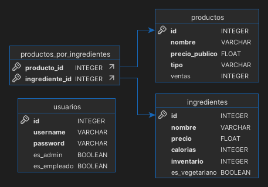

# Proyecto 2 - Heladería Web

Este proyecto implementa una aplicación web para gestionar una heladería, desarrollado como parte del curso **COLSUBSIDIO BACKEND CON PYTHON GRUPO 2**. La aplicación utiliza el framework Flask y permite realizar operaciones básicas como listar productos e ingredientes, registrar ventas y gestionar inventarios, con una base de datos administrada con SQLAlchemy.

## **Contenido**

- [Proyecto 2 - Heladería Web](#proyecto-2---heladería-web)
  - [**Contenido**](#contenido)
  - [**Características**](#características)
  - [**Requisitos**](#requisitos)
  - [**Instalación**](#instalación)
  - [**Ejecución**](#ejecución)
  - [**Estructura del Proyecto**](#estructura-del-proyecto)
  - [**Pruebas**](#pruebas)
  - [**Diagrama de Base de Datos**](#diagrama-de-base-de-datos)
  - [**Licencia**](#licencia)

---

## **Características**

1. Listar ingredientes disponibles, con información detallada (precio, calorías, inventario).
2. Listar productos disponibles, incluyendo sus ingredientes y rentabilidad.
3. Registrar ventas de productos, actualizando los inventarios automáticamente.
4. Manejar excepciones como inventarios insuficientes.
5. Pruebas unitarias para garantizar la calidad del código.
6. Base de datos administrada con SQLAlchemy.

---

## **Requisitos**

- Python 3.8 o superior
- Flask 2.0 o superior
- SQLAlchemy
- Bootstrap 5 (incluido en las plantillas HTML)
- MySQL o SQLite para la base de datos (por defecto se usa SQLite)

---

## **Instalación**

1. Clona este repositorio:
   ```bash
   git clone https://github.com/<usuario>/PROYECTO2-<login>.git
   cd PROYECTO2-<login>
   ```

2. Crea un entorno virtual:
   ```bash
   python -m venv venv
   source venv/bin/activate  # En Windows usa `venv\\Scripts\\activate`
   ```

3. Instala las dependencias:
   ```bash
   pip install -r requirements.txt
   ```

4. Configura el archivo `.env` con tus credenciales y configuración de base de datos:
   ```plaintext
   SECRET_KEY=<tu_clave_secreta>
   DATABASE_URI=sqlite:///database/HELADERIA.db
   ENABLE_PRINTS=True
   ```

---

## **Ejecución**

1. Asegúrate de que los datos iniciales (`ingredientes.csv` y `productos.csv`) estén en la carpeta `data`.

2. Inicia la aplicación:
   ```bash
   python app.py
   ```

3. Abre tu navegador y accede a:
   ```
   http://127.0.0.1:5000
   ```

---

## **Estructura del Proyecto**

```plaintext
|-- .env                       # Variables de entorno sensibles
|-- .gitattributes             # Configuraciones específicas de Git
|-- .gitignore                 # Archivos/carpetas ignorados por Git
|-- app/
|   |-- data_loader.py          # Carga datos desde archivos CSV
|   |-- extensions.py           # Inicialización de SQLAlchemy
|   |-- routes.py               # Rutas de Flask
|   |-- utils.py                # Funciones auxiliares
|   |-- __init__.py             # Configuración principal de Flask
|-- app.py                      # Punto de entrada principal de la app
|-- config.py                   # Configuración general del proyecto
|-- controllers/
|   |-- heladeria_controler.py  # Controladores para la lógica de negocio
|-- data/
|   |-- ingredientes.csv        # Datos iniciales de ingredientes
|   |-- productos.csv           # Datos iniciales de productos
|-- database/
|   |-- HELADERIA.db            # Base de datos SQLite
|-- docs/
|   |-- Diagrama_ER.png         # Diagrama entidad-relación
|   |-- Proyecto.pdf            # Enunciado del proyecto
|   |-- Rubrica Proyecto.pdf    # Rúbrica del proyecto
|-- LICENSE                     # Licencia del proyecto
|-- list.py                     # Archivo adicional no utilizado directamente
|-- models/
|   |-- heladeria.py            # Clase Heladería
|   |-- ingrediente.py          # Modelo Ingrediente
|   |-- producto.py             # Modelo Producto
|-- README.md                   # Documentación del proyecto
|-- requirements.txt            # Dependencias del proyecto
|-- run_tests.py                # Script para ejecutar pruebas
|-- templates/
|   |-- index.html              # Página principal
|   |-- ingredientes.html       # Vista de ingredientes
|   |-- productos.html          # Vista de productos
|   |-- resultado.html          # Vista de resultados
|   |-- vender.html             # Página para ventas
|-- tests/
|   |-- test_heladeria.py       # Pruebas unitarias
```

## **Pruebas**

Para ejecutar las pruebas unitarias, utiliza el siguiente comando:

```bash
python -m unittest discover tests
```

Esto ejecutará todas las pruebas definidas en el archivo `tests/test_heladeria.py`.

---

## **Diagrama de Base de Datos**

El siguiente diagrama muestra la relación entre las tablas `productos` e `ingredientes`:



---

## **Licencia**

Este proyecto está bajo la Licencia MIT. Consulta el archivo [LICENSE](LICENSE) para más detalles.

---

¡Gracias por revisar este proyecto! Si tienes preguntas o sugerencias, no dudes en contactarme.